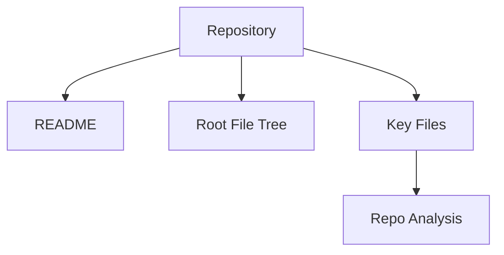

# Repo Analysis Markdown Renderer

## Purpose

`render_repo_analysis_markdown()` converts a `RepoAnalysisResult` into a
human-readable Chinese Markdown report. It is a pure presentation function: it
does not modify the result, fetch repositories, call an LLM, or mutate memory.

## Output Structure

The rendered Markdown uses Chinese section titles and Chinese explanatory text:

1. **① 项目整体介绍**: repository identity, GitHub URL, status, analysis sources, and rule-based analysis caveat
2. **② 架构说明**: Chinese architecture notes derived from metadata, key files, and module hints
3. **③ 模块关系图**: Mermaid `graph TD`
4. **④ 模块说明**: Chinese descriptions for known root directories
5. **⑤ 数据流说明**: conservative Chinese data-flow caveats
6. **⑥ 系统设计说明**: GitHub URL → GitHubRepoFetcher → RepoContext → RepoAnalysisWorkflow → Executor → DarwinReflector → SQLite Memory
7. **⑦ 工程备注**: engineering metadata
8. **⑧ Executor 规则型分析摘要**: optional Chinese executor report

## Mermaid Graph Generation

The module relationship graph is derived from `analysis_sections["modules"]`.
If module names can be inferred, the renderer emits `Repo --> module` edges and
connects each module to `Repo Analysis`.

If no modules can be parsed, it emits a conservative fallback graph:



## CLI Usage

```bash
python3 runtime/workflows/run_repo_analysis.py https://github.com/YGYOOO/WorldX --format markdown
```

The default output format remains JSON:

```bash
python3 runtime/workflows/run_repo_analysis.py https://github.com/owner/repo --format json
```
